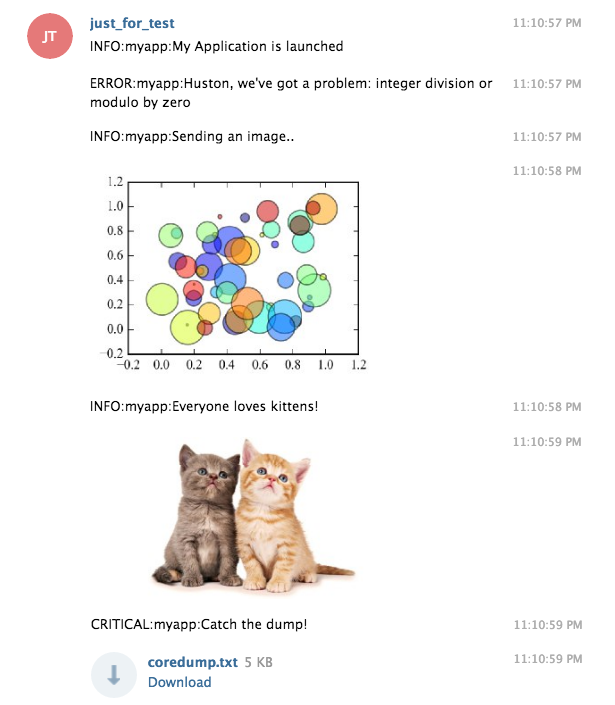

# Loggingbot
Add Telegram Bot to python's logging outputs

Below are code example and Telegram's Chat view.

## Code example

```python
import os 
import sys
sys.path.append(os.path.expanduser('~/code/loggingbot'))
from loggingbot import TelegramBotHandler
```

Telegram bot token (take it from [@botfather](https://telegram.me/botfather) ) and list of user ids where to send the messages are defined below. 

Note that this users should first start conversation the the bot (by telegram policy bots cannot send messages to unknown users). You can get particular user id by sending a message to bot and the check the updates from HTTP API like this `https://api.telegram.org/botXXXXXXXXX:XXXXXXXXXXXXX_XXXXXXXXXXXXXXXXXXXXX/getUpdates`.


```python
token = 'XXXXXXXXX:XXXXXXXXXXXXX_XXXXXXXXXXXXXXXXXXXXX'
user_list = ['YYYYYYYYY']
```

Let's set logging level to `INFO` for root logger. Then create a new log event handler `TelegramBotHandler` and attach it to root logger.

Note that [pyTelegramBotAPI](https://github.com/eternnoir/pyTelegramBotAPI) should be installed to
work with Telegram bot.


```python
import logging
logging.root.setLevel(logging.INFO)
tbh = TelegramBotHandler(token, user_list)
logging.root.addHandler(tbh)
```

As usual let's define some custom logger named `myapp`


```python
logger = logging.getLogger('myapp')
```

Everything is setup! Let's just use it! In order to send the message to bot you should provide `extra` dictionary argument into logging functions. You should define `bot` key to `True`.


```python
logger.info('My Application is launched', extra={'bot': True})
```

    INFO:myapp:My Application is launched


```python
try:
    x = 1 / 0
except Exception as e:
    logger.error("Huston, we've got a problem: %s", str(e), extra={'bot': True})
```

    ERROR:myapp:Huston, we've got a problem: integer division or modulo by zero


By the way, you can skip message to be sent to bot by avoiding `bot` key in `extra` dictionary.


```python
logger.info('This message will not be sent to bot')
```

    INFO:myapp:This message will not be sent to bot


The nice thing that you can send to chat not only text but text along with multimedia: **images, files and even matplotlib's figures**!


```python
# the demo taken from http://matplotlib.org/examples/shapes_and_collections/scatter_demo.html
"""
Simple demo of a scatter plot.
"""
import numpy as np
import matplotlib.pyplot as plt


N = 50
x = np.random.rand(N)
y = np.random.rand(N)
colors = np.random.rand(N)
area = np.pi * (15 * np.random.rand(N))**2  # 0 to 15 point radii

plt.scatter(x, y, s=area, c=colors, alpha=0.5)

logger.info('Sending an image..', extra={'bot': True, 'figure': plt.gcf()})
```

    INFO:myapp:Sending an image..


The images or files can be sent by providing its path or file object:


```python
with open(os.path.expanduser('~/Downloads/kittens.jpg')) as fin:
    logger.info('Everyone loves kittens!', extra={'bot': True, 'image': fin})
```

    INFO:myapp:Everyone loves kittens!


```python
logger.fatal('Catch the dump!', extra={'bot': True, 'file': '~/coredump.txt'})
```

    CRITICAL:myapp:Catch the dump!


## How it looks like in Telegram


